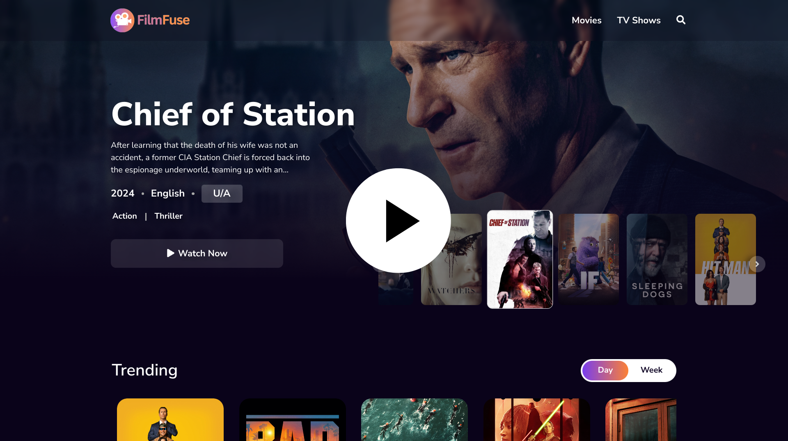

<p align="center">
  <a href="https://filmfuse.vercel.app/" target="_blank">
    
  </a>
</p>
<h4 align="center">
  Welcome to FilmFuse! A hub for all your favorite Movies and TV shows.
</h4>

## About

FilmFuse is a client-heavy web application that provides users with an intuitive platform to explore, search, and discover movies. Leveraging the power of React, this application ensures a seamless and responsive user experience, offering features like movie details, ratings, and recommendations.

## Demo

Click on the banner down below to check out the demo of FilmFuse.

<p align="center">
  <a href="https://drive.google.com/file/d/14JtvN_FrXAtUJ9ZgkM5EAQkUrhArV4wi/view?usp=drive_link" target="_blank">
    
  </a>
</p>

## Features

- **Movie Search**: Easily search for movies by title, genre, or actor.
- **Detailed Movie Information**: View comprehensive details about selected movies, including synopsis, cast, and ratings.
- **User Reviews and Ratings**: Check out reviews and ratings from other users.
- **Category Togglers**: Switch between different categories of movies effortlessly.
- **Genre and Keyword Search**: Filter movies by genre or search using keywords.
- **Infinite Scroll**: Smoothly scroll through endless lists of movies without pagination.
- **Recommendations and Similar Titles**: Get movie recommendations and find similar titles based on your interests.

## Technologies Used

- **ReactJS**: A JavaScript library for building user interfaces.
- **SASS**: A preprocessor scripting language that is interpreted or compiled into CSS.
- **TypeScript**: A superset of JavaScript that adds static types.
- **TMDB API**: The Movie Database API to fetch extensive movie and TV show data.
- **ReactContext API**: A way to manage state globally.
- **Vercel**: A cloud platform for static sites and Serverless Functions.

## Installation

Follow these steps to set up the project locally:

1. **Clone the repository**:

   ```sh
   git clone https://github.com/thedevangvishnu/filmfuse.git
   cd filmfuse
   ```

2. **Install dependencies**:
   Make sure you have [Node.js](https://nodejs.org/) installed. Then, run:

   ```sh
   npm install
   ```

3. **Set up the environment variables**:

   - Create an account of [TMDB website](#https://www.themoviedb.org/).
   - Click on your profile icon on the top-right and go to "Settings."
   - Go to the "API" tab and copy the `API Read Access Token`.
   - Use the `.env.example` to create an `.env` file in the root directory and add your TMDB API Token:

   ```sh
   VITE_APP_TMDB_TOKEN==your_tmdb_access_token_here
   ```

4. **Run the application**:

   ```sh
   npm run dev
   ```

5. Open [http://localhost:3000](http://localhost:3000) to view it in the browser.

## Acknowledgements

- Special thanks to [TMDB](https://www.themoviedb.org/) for providing the API.
